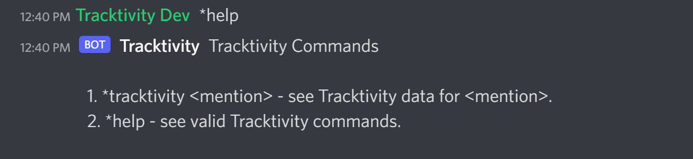
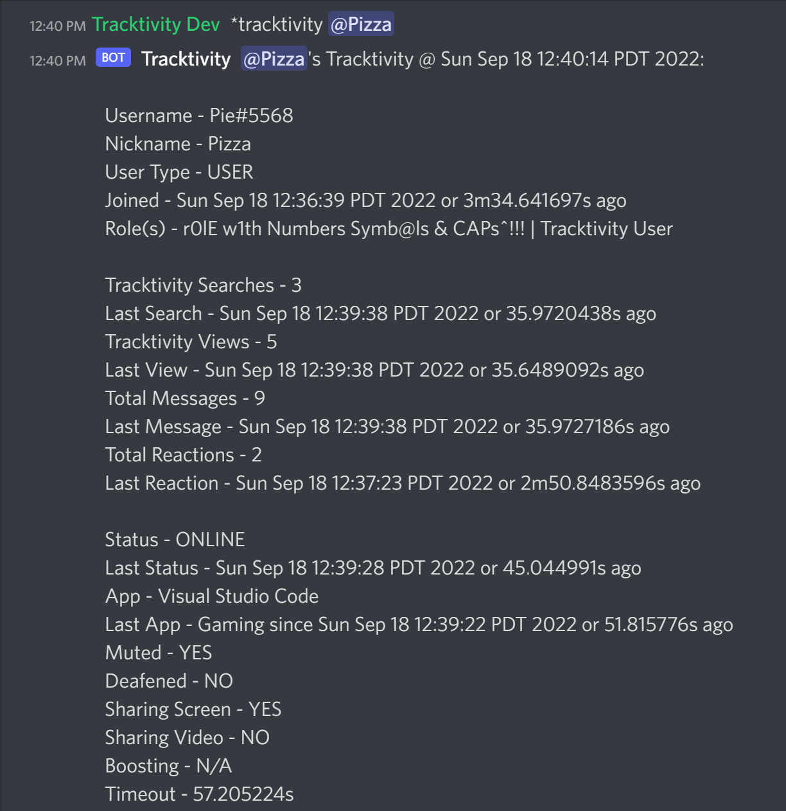

# tracktivity-discord-bot
A simple Discord bot written in Go that tracks activity and provides reports for users in your Discord server.

## Tracktivity has two commands:

### 1. *help
- Describes the Tracktivity commands and their proper syntax and usage:

### 2. *tracktivity <mention>
- Reports the Tracktivity profile of the mentioned user, if valid:

## Tracktivity Report
**Username**: The user's Discord username and discriminator (N/A, if unknown)
**Nickname**: The user's server name/nick (N/A, if unknown)
**User Type**: The user's user type (BOT, USER, or N/A, if unknown)
**Joined**: The timestamp when the user joined the server (N/A, if unknown)
**Role(s)**: The user's server roles (N/A, if role names unknown or no roles)

**Tracktivity Searches**: The number of Tracktivity searches made by the user
**Last Search**: The timestamp when the user last made a Tracktivity search
**Tracktivity Views**: The number of Tracktivity reports generated for the user
**Last View**: The timestamp when a Tracktivity report was last generated for the user
**Total Messages**: The total number of messages the user has sent
**Last Message**: The timestamp when the user last sent a message
**Total Reactions**: The total number of reactions the user has sent
**Last Reaction**: The timestamp when the user last sent a reaction

**Status**: The user's Discord status (Unknown, if unknown)
**Last Status**: The timestamp when the user's status last changed
**App**: The user's current activity (N/A, if none)
**Last App**: The timestamp when the user began their current activity (N/A, if none)
**Muted**: The user's muted status (N/A, if unknown)
**Deafened**: The user's deafened status (N/A, if unknown)
**Sharing Screen**: The user's screen-sharing status (N/A, if unknown)
**Sharing Video**: The user's video-sharing status (N/A, if unknown)
**Boosting**: The timestamp when the user began boosting the server (N/A, if unknown or not boosting)
**Timeout**: The remaining duration of the user's timeout (N/A, if not timed out)

## Known Bugs

### 1. Multiple Server Compatability and Continuity
The underlying data structures used to store Tracktivity data do not take into account the server. As a result, using the bot on multiple servers with common users can lead to misleading Tracktivity reports.

### 2. Lack of Prior User and Server Data
Tracktivity only stores/tracks data acquired after the bot has joined and is not capable of grabbing user and server data and changes made before the bot joined the server. As a result, generating Tracktivity reports for users who were present in a server before the bot joined may lead to partially misleading or unknown data.
